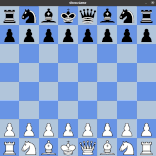

# ChessEngine
### General Information :
I've started this project for a self-study challenge, after having been exposed from several places.
I used help from two main step-by-step guides:
1) [A step-by-step guide to building a simple chess AI](https://www.freecodecamp.org/news/simple-chess-ai-step-by-step-1d55a9266977/)
2) [Writing a chess program in one day](https://andreasstckl.medium.com/writing-a-chess-program-in-one-day-30daff4610ec)

And also the wiki chess programming page:
[chess-programming](https://www.chessprogramming.org/Main_Page)

### Get Started :
1) Clone project to a directory on your pc.
2) Install dependencies -  
**pygame**  
linux - `python3 -m pip install -U pygame --user`  
windows - `py -m pip install -U pygame --user`  
**NumPy**  
linux - `python3 -m install -U numpy --user`  
windows - `py -m install -U numpy --user`  
4) Run command `python3 chessGame.py`

### Implementaion :
I used python with two main packages:   
- NumPy
- Pygame 

### TODO :
At current point, the engine able to play one on one game and allows the player choose the opponents level rank from 0 to 4
where -0- replies a randome player, -1- one step forward computing engine, ... , -4- four steps computing ahead.

My next steps would be:
1) changing engine computing implementation, so he won't stop thinking between each turn.
2) reboosting algorithm to be more efficient.
3) add strategies to engine evaluation position method.
4) add annimation and more detailed interface.
